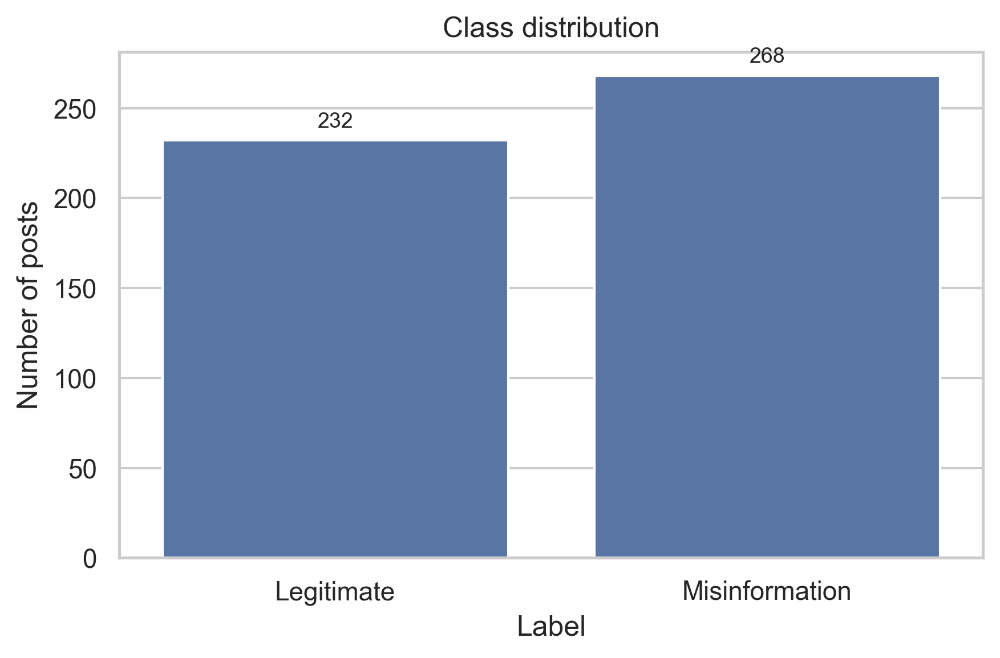
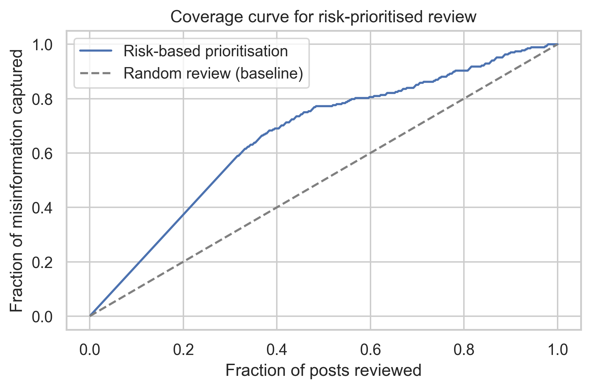

# AI Misinformation Detection & Risk-Based Prioritisation

Academic Team Project | IIT Madras Industry 4.0 (GAABS 4.0)

---

## Team Project

This project was developed as part of the IIT Madras Industry 4.0 (GAABS 4.0) coursework by Team 7.

### Team Members

* Akula Geetha Maheswari
* Abhyudaya B Tharakan
* Aditya Singh
* Akshaj Barve
* Sarthak Vashistha

This repository is maintained by Akula Geetha Maheswari for portfolio and learning purposes.

### Original Team Repository

[Original Team Repository](https://github.com/ALikesToCode/industry-4.0-gaabs-analysis)

> Note: This repository is a portfolio version maintained by Akula Geetha Maheswari. Credit for the project belongs to the entire project team.

---

This repository delivers an end-to-end analytics, prediction, and optimisation pipeline that treats social-media misinformation control as a **Quality 4.0** problem inside an Industry 4.0 ecosystem. Starting from a 500-row synthetic dataset, we quantify risk patterns, train classifiers to obtain misinformation probabilities, and allocate scarce manual-review capacity to maximise harmful-engagement reduction.

The project is designed to be report-ready: every figure, table, and metric is regenerated via a single script and cross-referenced in the analysis report for quick integration into presentations or academic submissions.

---

## Skills Demonstrated

* Machine Learning
* Classification
* Random Forest
* Logistic Regression
* Natural Language Processing (NLP)
* TF-IDF Vectorization
* Feature Engineering
* Exploratory Data Analysis (EDA)
* Data Visualization
* Risk-Based Optimization
* Python
* Pandas
* Scikit-learn

---

## Table of Contents

* [Team Project](#team-project)
* [Problem Framing](#problem-framing)
* [Repository Layout](#repository-layout)
* [Environment & Reproducibility](#environment--reproducibility)
* [Pipeline Overview](#pipeline-overview)
* [Key Findings](#key-findings)

  * [Dataset Snapshot](#dataset-snapshot)
  * [Exploratory Analytics](#exploratory-analytics)
  * [Predictive Modelling](#predictive-modelling)
  * [Risk-Based Optimisation](#risk-based-optimisation)
* [Industry 4.0 Alignment](#industry-40-alignment)
* [Next Steps](#next-steps)
* [Acknowledgements](#acknowledgements)

---


## Problem framing

We cast misinformation prioritisation as an optimisation problem:

* **Decision variable**: \(x_i = 1\) if post *i* is routed to manual fact-checking, 0 otherwise.
* **Objective**:
  \[
  \max \sum_i x_i \cdot \left(p_i \times \text{engagement}_i\right)
  \]
  where \(p_i\) is the modelled probability of post *i* being misinformation and `engagement` is the expected audience reach (a proxy for harm).
* **Constraints**:
  * Capacity: \(\sum_i x_i \leq K\) (daily review bandwidth).
  * Optional platform quotas: \(\sum_{i \in \text{platform}} x_i \leq K_{\text{platform}}\).

This mirrors supplier quality triage in Industry 4.0: the “products” are digital posts, and the quality gate blends AI scoring with human inspectors.

---

## Repository layout

```
analysis/
  run_analysis.py         # Main pipeline (EDA + modelling + optimisation + figures)
genai-dataset/
  generative_ai_misinformation_dataset.csv
docs/
  figures/                # 59 regenerated PNGs (referenced in analysis_report.md)
  GAABS 4.0 Project Summary Report.pdf
  analysis_report.pdf
  project_summary.pdf
reports/
  metrics_summary.json    # Structured output of stats, model metrics, optimisation table
  risk_coverage_curve.csv # Data behind the coverage chart
  analysis_report.md      # Narrative describing each figure and insight
requirements.txt          # Python dependencies (pinned to analysis run)
README.md                 # This document
```

---

## Environment & reproducibility

```bash
python -m venv .venv
.venv/bin/python -m pip install -r requirements.txt
.venv/bin/python analysis/run_analysis.py
```

All outputs land under `reports/`. The script prints a JSON summary to stdout and writes the same structure to `reports/metrics_summary.json`. The `analysis_report.md` document explains every figure and can be used as a ready-made appendix.

> **Note on features:** The source CSV exposes 31 columns. The pipeline engineers four auxiliary columns (`hour`, `label_name`, `author_followers_log10`, `engagement_log10`) for modelling, yielding 35 in-memory features.

---

## Pipeline overview

1. **Data loading & enrichment**
   * Parse timestamps, derive month/weekday/hour, log-scale follower/engagement counts.
   * Create clean categorical labels for plotting.
2. **Exploratory data analysis**
   * 59 charts covering platform, temporal, content, structural, reliability, and author dimensions.
   * Output saved in `docs/figures/`; see `analysis_report.md` for per-figure commentary.
3. **Machine learning**
   * Baseline: Logistic Regression with balanced class weights.
   * Advanced: Random Forest with metadata + TF-IDF bigrams (500 features) reduced via TruncatedSVD (50 latent topics).
   * Shared train/test split (70/30 stratified).
4. **Risk-based optimisation**
   * Use Random Forest probabilities to compute expected harm \(h_i = p_i \times \text{engagement}_i\).
   * Rank posts and generate review-capacity coverage curves + summary table.

---

## Key findings

### Dataset snapshot

* **Population**: 500 posts across Twitter (129), Facebook (126), Telegram (124), and Reddit (121).
* **Label balance**: 268 misinformation (53.6%) vs. 232 legitimate posts (46.4%).
* **Temporal coverage**: Full calendar year with weekday & hourly granularity.



### Exploratory analytics

See `reports/analysis_report.md` for the full narrative and figure references. Highlights:

* **Platform risk**: Twitter has the highest misinformation prevalence (~60%) compared to other channels (~51%).
  * Figures: `docs/figures/platform_counts.png`, `docs/figures/misinformation_rate_by_platform.png`.
* **Temporal spikes**: May and September peak above 60% misinformation share; Fridays and Mondays are the riskiest weekdays.
  * Figures: `docs/figures/monthly_misinformation_rate.png`, `docs/figures/weekday_misinformation_rate.png`, `docs/figures/hourly_misinformation_rate.png`.
* **Content tone**: Harmful posts skew negative (`sentiment_score` ↓) without being more toxic.
  * Figures: `docs/figures/sentiment_by_label.png`, `docs/figures/toxicity_by_label.png`.
* **Narrative depth**: Misinformation uses longer text and more tokens.
  * Figures: `docs/figures/text_length_by_label.png`, `docs/figures/token_count_hist_by_label.png`.
* **Source reliability**: Slightly lower for misinformation, reinforcing the value of domain reputation.
  * Figure: `docs/figures/source_reliability_by_label.png`.
* **Engagement parity**: Harmful and legitimate posts attract similar engagement; triage must combine risk and reach.
  * Figures: `docs/figures/engagement_by_label.png`, `docs/figures/followers_vs_engagement_scatter.png`.
* **Multivariate insight**: No single numeric feature correlates strongly (|r| < 0.1), justifying multivariate ML.
  * Figure: `docs/figures/correlation_heatmap.png`.

### Predictive modelling

| Model | Accuracy | Precision (misinfo) | Recall (misinfo) | F1 (misinfo) | ROC-AUC |
| --- | --- | --- | --- | --- | --- |
| Logistic Regression (balanced, TF-IDF) | 0.487 | 0.516 | 0.612 | 0.560 | 0.470 |
| Random Forest (400 trees + SVD topics) | **0.553** | **0.554** | **0.838** | **0.667** | **0.481** |

* Figures: `docs/figures/random_forest_confusion_matrix.png`, `docs/figures/random_forest_roc_curve.png`, `docs/figures/random_forest_feature_importance.png`.
* **Interpretation**:
  * Text bigrams combined with metadata substantially boost recall (84%) but probability calibration remains challenging (ROC-AUC ≈ 0.48).
  * Top features blend surface signals (token_count, sentiment, toxicity, engagement) with latent text topics extracted via SVD, alongside domain reliability cues.
  * Despite modest AUC, the model offers actionable triage: high recall ensures most harmful posts enter the manual-review shortlist.

### Risk-based optimisation

Using model probabilities with engagement weighting improves moderation efficiency:



| Daily review capacity | % posts screened | Misinfo captured | % of all misinfo | Expected harmful engagement mitigated |
| --- | --- | --- | --- | --- |
| 10 | 2% | 10 | 3.7% | 78,860 |
| 20 | 4% | 20 | 7.5% | 152,824 |
| 50 | 10% | 50 | 18.7% | 362,753 |
| 100 | 20% | 100 | 37.3% | 654,754 |
| 150 | 30% | 150 | 55.9% | 880,086 |

* Prioritising the top 30% highest-risk posts captures **~56%** of all misinformation exposure (measured by harmful engagement), doubling efficiency versus random review.
* The pipeline exports the underlying table in `reports/metrics_summary.json` and `reports/risk_coverage_curve.csv` for downstream What-If analysis.

---

## Industry 4.0 alignment

| Syllabus theme | Project hook |
| --- | --- |
| Week 4 – Classification / Supplier selection | Legitimate vs. misinformation posts mirror supplier approval via supervised learning. |
| Week 6 – Prognosis & predictive maintenance | Probabilistic risk scores act as early-warning indicators for harmful narratives. |
| Week 7 – Quality 4.0 | Automates digital quality checks, fusing AI “sensors” with human inspectors. |
| Week 8 – Optimisation & resource allocation | Review slots become scarce resources allocated via a knapsack-style prioritisation. |
| Week 10 – Logistics 4.0 | Guides how moderation teams (the “fleet”) are dispatched across platforms and time windows. |
| Weeks 11–12 – Future factory | Demonstrates responsible AI governance and trust management in digital supply chains. |

We recommend weaving these hooks directly into slides or reports to match Industry 4.0 evaluation rubrics.

---

## Next steps

1. **Probability calibration** – Apply isotonic or Platt scaling to improve score reliability for threshold setting.
2. **Richer embeddings** – Replace TF-IDF with transformer embeddings (e.g., MiniLM, MPNet) to lift ROC-AUC.
3. **Scenario engine** – Extend optimisation to include reviewer skill constraints, platform quotas, or fairness targets.
4. **Interactive dashboard** – Wrap `reports/metrics_summary.json` into a Streamlit/Plotly dashboard for stakeholder exploration.
5. **Governance metrics** – Add fairness checks (platform/country recall parity) and alerting thresholds for deployment.

For a graph-by-graph narrative, consult `reports/analysis_report.md`—each figure there is directly shareable with instructors, stakeholders, or executive decision-makers.


## Acknowledgements

This repository contains a portfolio version of an IIT Madras Industry 4.0 team project.

Credit for the project belongs to the full project team. This repository is maintained for educational, learning, and portfolio purposes.
